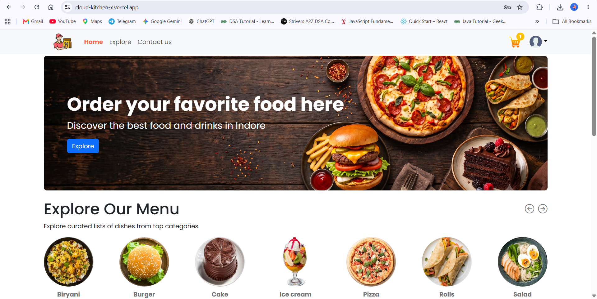
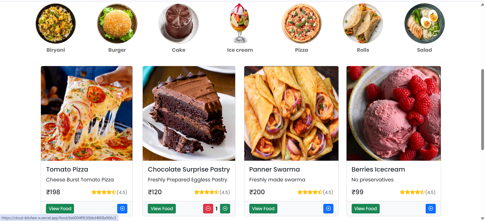
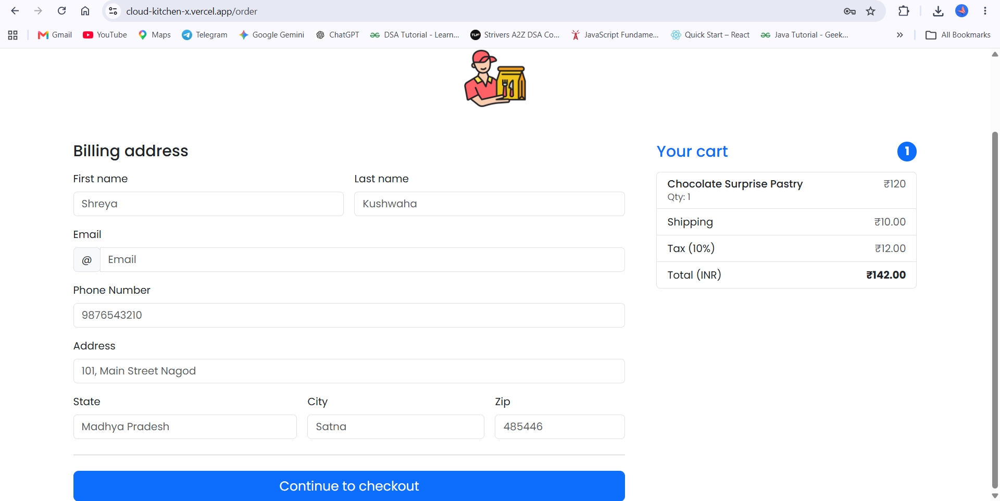
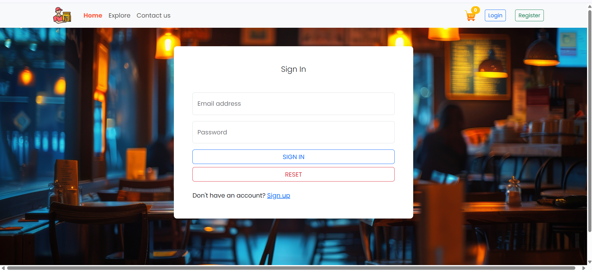
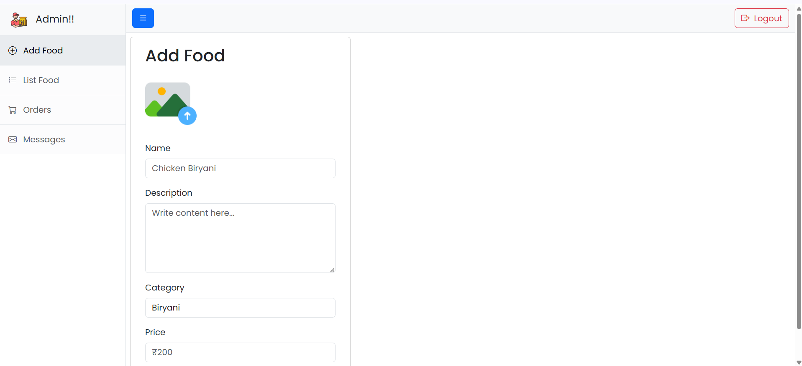
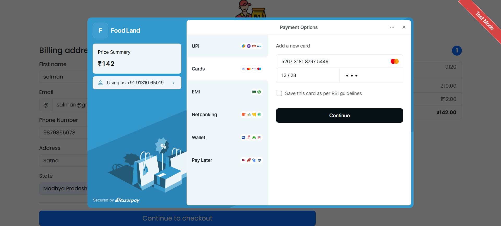

# CloudKitchenX - Food Ordering Web Application

A full-stack food ordering web application with a customer-facing storefront and a role-protected admin panel, built with **Spring Boot**, **React**, and **MongoDB**.

🔗 **Live Demo:** https://cloud-kitchen-x.vercel.app
📦 **Repository:** https://github.com/shreyak20030903/CloudKitchenX

> Note: the backend runs on Render's free tier, which sleeps after ~15 minutes of inactivity. The first request after idle time may take 30-60 seconds to respond while the server wakes up — this is expected, not a bug.

---

## Screenshots













---

## Features

### User side
- User registration and login with JWT-based authentication
- Browse menu by category, view food details
- Add to cart, adjust quantities, checkout
- Secure online payments via Razorpay, with signature verification on the backend
- Order history ("My Orders") with live order status
- Contact form that saves messages to the database

### Admin side
- Role-based access — only accounts with the `ADMIN` role can reach admin routes and admin-only APIs
- Add, list, and delete food items (images uploaded to AWS S3)
- View and update order status for all users
- View contact form submissions
- Runs within the same single React app as the user side, gated by protected routes

---

## Tech Stack

**Frontend:** React (Vite), React Router, Axios, Bootstrap
**Backend:** Spring Boot, Spring Security, JWT
**Database:** MongoDB (MongoDB Atlas in production)
**Payments:** Razorpay
**File Storage:** AWS S3 (food images)
**Deployment:** Vercel (frontend) · Render (backend, via Docker) · MongoDB Atlas (database)

---

## Project Structure

```
CloudKitchenX/
├── backendapi/          # Spring Boot backend
│   ├── src/main/java/in/shreya/backendapi/
│   │   ├── config/       # Security & AWS configuration
│   │   ├── controller/   # REST controllers
│   │   ├── entity/       # MongoDB document models
│   │   ├── filters/      # JWT authentication filter
│   │   ├── io/           # Request/response DTOs
│   │   ├── repository/   # Spring Data MongoDB repositories
│   │   ├── service/      # Business logic
│   │   └── util/         # JWT utility
│   └── Dockerfile
│
└── Fronted UI/           # React frontend
    └── src/
        ├── admin/         # Admin panel (components, pages, services)
        ├── components/    # Shared user-side components
        ├── context/       # Global state (StoreContext)
        ├── pages/         # User-facing pages
        ├── service/       # API service files
        └── util/          # Helper utilities
```

---

## Running Locally

### Prerequisites
- Node.js and npm
- Java 17 and Maven
- A local or Atlas MongoDB instance
- AWS S3 bucket (for image uploads)
- Razorpay test account (for payments)

### 1. Clone the repository
```bash
git clone https://github.com/shreyak20030903/CloudKitchenX.git
cd CloudKitchenX
```

### 2. Backend setup
```bash
cd backendapi
```
Create a `src/main/resources/application-local.properties` file (or set environment variables) with:
```properties
spring.data.mongodb.uri=mongodb://localhost:27017/CloudKitchenX
jwt.secret.key=your_jwt_secret
razorpay_key=your_razorpay_test_key
razorpay_secret=your_razorpay_test_secret
aws.access.key=your_aws_access_key
aws.secret.key=your_aws_secret_key
```
Run the application:
```bash
./mvnw spring-boot:run
```
Backend runs on `http://localhost:8080`.

### 3. Frontend setup
```bash
cd "Fronted UI"
npm install
```
Create a `.env.local` file:
```
VITE_API_BASE_URL=http://localhost:8080/api
```
Run the dev server:
```bash
npm run dev
```
Frontend runs on `http://localhost:5173`.

---

## Environment Variables Reference

| Variable | Used in | Description |
|---|---|---|
| `MONGODB_URI` | Backend | MongoDB connection string |
| `JWT_SECRET` | Backend | Secret key for signing JWT tokens |
| `RAZORPAY_KEY` | Backend | Razorpay public key |
| `RAZORPAY_SECRET` | Backend | Razorpay secret key (server-side only) |
| `AWS_ACCESS_KEY` | Backend | AWS access key for S3 image uploads |
| `AWS_SECRET_KEY` | Backend | AWS secret key for S3 image uploads |
| `VITE_API_BASE_URL` | Frontend | Base URL the frontend uses to call the backend API |

---

## Notes

- Razorpay is configured in **test mode** — no real payments are processed.
- Admin access is role-based; a user becomes an admin by having `role: "ADMIN"` set on their user document.
